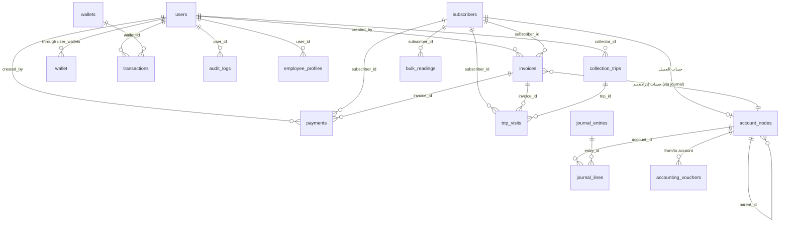

# التوثيق الفني الكامل – نظام فواتير المياه

> نظام ويب متكامل لإدارة مشتركي المياه: الفواتير، القراءات، التحصيل والسداد، المحاسبة، التقارير، الطباعة والتصدير، وإرسال واتساب.
> **التقنية:** Flask + SQLAlchemy + SQLite + Bootstrap 5.3 (RTL) + PWA.

---

## 1) نظرة عامة على المعمارية

النظام هو **تطبيق Flask أحادي (Monolith)** يُبنى عبر دالة مصنع `create_app()` في `app.py`، ويستخدم:

| الطبقة | التقنية |
|---|---|
| الواجهات | قوالب Jinja2 داخل `templates/` + Bootstrap 5.3.3 RTL + Bootstrap Icons |
| الخادم | Flask (وضع تطوير، Debug، منفذ افتراضي **5006**) |
| قاعدة البيانات | SQLite في `instance/water_billing.sqlite3` عبر **SQLAlchemy 2.0** + طبقة توافق تحاكي أسلوب `sqlite3` القديم |
| توليد PDF | **Playwright/Chromium** في `app.py` (فواتير منفردة وجماعية) و **WeasyPrint** (اختياري) في وحدة التحصيل اليدوي |
| إرسال واتساب | طلبات HTTP إلى API خارجي (`whatsapp_api_url`) |
| PWA | `manifest.json` + `service-worker.js` + `offline.html` + أيقونات بأحجام متعددة |

### مخطط المعمارية (Mermaid)

```mermaid
flowchart TD
    U[المستخدم] --> B[Flask app: create_app]
    B --> T[templates/ Jinja2 RTL]
    B --> R[المسارات في app.py]
    B --> BP1[Blueprint payments /payments]
    B --> BP2[Blueprint manual_collection /manual-collection]
    T --> S[static/: css - js - icons - PWA]
    R --> DB[(database.py: طبقة SQLAlchemy + توافق)]
    BP1 --> DB
    BP2 --> DB
    DB --> SQL[(SQLite instance/water_billing.sqlite3)]
    DB --> MOD(models.py: نماذج SQLAlchemy + المحاسبة)]
    R --> PDF[Playwright -> PDF]
    BP2 -. WeasyPrint .-> PDF2[PDF أوراق التحصيل]
    R --> WA[WhatsApp API خارجي]
    S --> PWA[Service Worker + Manifest]
```

**لحظة الإقلاع (`create_app`)**: `init_db(app)` تُنشئ الجداول وتزامن المخطط → `init_accounting()` تزرع شجرة الحسابات الأساسية إن كانت فارغة → `ensure_all_party_accounts()` تُنشئ تلقائياً حسابات موظفين/عملاء → تسجيل الـ Blueprints → `before_request` يحمّل المستخدم الحالي → `context_processor` يمرر `current_user`, `user_role`, `setting`, `today`… لكل القوالب.

---

## 2) التشغيل وبيانات الدخول

```bash
pip install -r requirements.txt
python run.py            # المنفذ 5006 (Variable PORT للتغيير)
```

- بيانات دخول افتراضية: المستخدم **`zydan`** / كلمة المرور **`774952665`**.
- قاعدة البيانات تُنشأ تلقائياً عند أول تشغيل داخل `instance/`.
- `run.py` يستثني مجلدات مكتبات Python من مراقبة إعادة التحميل (Watchdog) لتجنب إعادة تشغيل عشوائية.
- `SECRET_KEY` من متغير البيئة (قيمة احتياطية عامة يجب تغييرها في الإنتاج).

---

## 3) قاعدة البيانات

### 3.1 مخطط العلاقات (ERD)



### 3.2 الجداول والأعمدة

| الجدول | الغرض | أهم الأعمدة |
|---|---|---|
| **users** | مستخدمو النظام (Admin/Staff/Collector/Technician/Accountant/Manager) | `id, username(UNIQUE), password_hash, role, wallet_id, active` |
| **subscribers** | المشتركون | `id, account_number(UNIQUE), name, meter_number, phone, village, address, default_unit_price, default_subscription_fee, last_reading, last_due_amount, last_paid_amount, active, notes` |
| **invoices** | الفواتير | `id, invoice_no(UNIQUE), subscriber_id(FK), invoice_date, month_label, previous_reading, current_reading, previous_reading_date, current_reading_date, consumption, unit_price, consumption_amount, subscription_fee, other_charges, opening_balance, total_amount, credit_amount, paid_amount, remaining_amount, previous_arrears, printed_*/sent_*, journal_entry_id, created_by` |
| **bulk_readings** | القراءات الجماعية قبل إنشاء الفواتير | `id, subscriber_id(FK), previous_reading, current_reading, reading_date, month_label, invoiced(0/1)` |
| **payments** | السدادات | `id, invoice_id(FK), subscriber_id, amount, payment_date, method, notes, attachment_path, created_by` |
| **settings** | إعدادات النظام (key/value) | `key(PK), value` |
| **attachments** | مرفقات الفواتير | `id, invoice_id(FK), filename, path, mime_type, uploaded_at` |
| **wallets** | صناديق/محافظ | `id, name(UNIQUE), balance, created_at` |
| **user_wallets** | ربط متعدد-لمتعدد المستخدمين بالصناديق | `user_id(FK), wallet_id(FK), PK مركّب` |
| **transactions** | حركات الصناديق (IN/OUT) | `id, type(IN/OUT), amount, wallet_id(FK), user_id(FK), subscriber_id, reference_id, notes` |
| **audit_logs** | سجل التدقيق | `id, user_id(FK), action(INSERT/UPDATE/DELETE/EXPENSE…), table_name, row_id, description, timestamp` |
| **account_nodes** | شجرة الحسابات المحاسبية | `id, code(UNIQUE), name, node_type(root/account/cash/receivable/income/expense…), parent_id(ذاتي), is_postable, active` |
| **employee_profiles** | ملفات الموظفين المحاسبية | `id, user_id(FK UNIQUE), account_node_id(FK), full_name, job_title, monthly_target, active` |
| **journal_entries** | قيود اليومية | `id, entry_no(UNIQUE), entry_date, source_type, source_id, description, created_by` |
| **journal_lines** | أطراف قيود اليومية (طرفان على الأقل) | `id, entry_id(FK), account_id(FK), debit, credit, description` |
| **accounting_vouchers** | السندات المحاسبية | `id, voucher_no(UNIQUE), voucher_type, voucher_date, amount, from_account_id(FK), to_account_id(FK), reference, description, source_type/source_id, journal_entry_id, status` |
| **collection_trips** | جولات التحصيل | `id, collector_id(FK), trip_date, status(open/closed), target_amount, collected_amount, notes, started_at, closed_at` |
| **trip_visits** | زيارات الجولة للفواتير | `id, trip_id(FK CASCADE), invoice_id(FK), subscriber_id(FK), status(pending/paid…), amount_collected, visited_at` |

### 3.3 ملاحظات تقنية على المخطط

- **التواريخ مخزّنة كنصوص ISO** (`YYYY-MM-DD` أو ISO8601 للطوابع الزمنية) لسهولة العرض والمقارنة النصية.
- **قيود CHECK** تمنع القيم السالبة على أغلب الحقول المالية (في `Invoice`, `Payment`, `Transaction`, `Wallet`, `JournalLine`, `Voucher`, `CollectionTrip`, `TripVisit`, `BulkReading`).
- **المزامنة التلقائية للمخطط**: `sync_sqlalchemy_schema()` في `database.py` تضيف أي عمود جديد معرّف في `models.py` إلى الجداول الموجودة عند الإقلاع (لا تحتاج تهجير يدوي؛ مثل عمودي `previous_reading_date`/`current_reading_date`).
- **العمود `previous_reading_date`**: يُعبّأ تلقائياً عند إنشاء فاتورة جديدة (من آخر قراءة معروفة عبر `previous_reading_date_for()`) ويعرض في الفاتورة `من … إلى …`، ويبقى `—` إذا لم تتوفر قراءة سابقة.

---

## 4) ملفات المشروع – شرح كل ملف

### 4.1 ملفات بايثون (الجذر)

| الملف | الوظيفة |
|---|---|
| **app.py** | التطبيق الرئيسي (≈4000 سطر): دالة المصنع + كل المسارات + الدوال المساعدة (تفاصيل في القسم 5). |
| **database.py** | طبقة البيانات: إنشاء الجداول، طبقة التوافق `SQLAlchemyDBProxy` (تسمح بـ`db.execute("SELECT…")` بأسلوب sqlite3 فوق ORM)، إعدادات النظام، المحاسبة، النسخ الاحتياطي، وغيرها. |
| **models.py** | نماذج SQLAlchemy للجداول + `init_accounting()` (زرع شجرة الحسابات) + دوال المحاسبة (`account_tree`, `record_journal_entry`, `find_account`). |
| **run.py** | نقطة تشغيل التطبيق على `0.0.0.0:5006` مع Debug واستثناء مجلدات النظام من المراقبة. |
| **financial_fixes.py** | Blueprint **التحصيل اليدوي** (`/manual-collection/*`): أوراق قراءات وتحصيل يومية، سداد جماعي، ملخص، إعادة ضبط مالية، توليد PDF عبر WeasyPrint أو رسالة خطأ عند غياب مكتبات GTK. |
| **payments.py** | Blueprint **السندات** (`/payments/*`): فهرس السندات وأرصدة الحسابات + إضافة سداد مع مرفق عبر `process_invoice_payment`. |
| **financial.py** | Blueprint مالي **قديم غير مسجَّل** (بديل مكتمل موجود في app.py). |
| **import_custom.py** | سكربت استيراد أحادي الاستخدام من `كشوفات 2026.xlsx` (إدخال/تحديث مشتركين + فواتير + ترحيل محاسبي). |
| **init_schema.py** | سكربت تهيئة قاعدة البيانات (استدعاء `init_db`). |
| **create_user.py** | سكربت إنشاء مستخدم جديد من الطرفية (`python create_user.py`). |
| **reset_financials.py** | سكربت إعادة تعيين البيانات المالية (مع نسخ احتياطي تلقائي) – ضروري قبل اختبار المحاسبة. |

### 4.2 ملفات الحواف والدعم

| الملف | الوظيفة |
|---|---|
| **requirements.txt** | الاعتماديات: Flask، requests، openpyxl، weasyprint (اختياري)، qrcode، Pillow، gunicorn، SQLAlchemy==2.0.50. |
| **preview.json** | عيّنة بيانات معاينة لأداة الاستيراد (أعمدة/صفوف تجريبية). |
| **README.md** | دليل سريع: بيانات الدخول، التشغيل، أبرز الميزات. |
| **server_out.log / server_err.log** | سجلات إخراج/أخطاء الخادم أثناء التشغيل في وضع الخلفية. |

### 4.3 مجلد `templates/`

| القالب | يُستخدم في | الوظيفة |
|---|---|---|
| `base.html` | كل الصفحات | الهيكل والتنقل: navbar بقوائم منسدلة RTL (`الحسابات والمشتركين، الإدارة، الفواتير، التقارير، التحصيل، …`) + فلاش + PWA + الثيمات. **إصلاح حديث:** أُضيف `dropdown-menu-end` لقائمة التحصيل لتمنع خروجها خارج الشاشة. |
| `dashboard.html` | `/` | لوحة المدير: مؤشرات KPI، رسم شهري (أعمدة + نسبة التحصيل Doughnut)، أعلى المدينين، آخر الفواتير. |
| `dashboard1.html` | — (بديل قديم للوحة) | نسخة سابقة من اللوحة. |
| `login.html` | `/login` | صفحة تسجيل الدخول. |
| `subscribers_list.html` | `/subscribers` | قائمة المشتركين (بحث/تعديل/حذف). |
| `subscriber_form.html` | `/subscribers/new`, `/subscribers/<id>/edit` | نموذج إنشاء/تعديل مشترك. |
| `invoices_list.html` | `/invoices` | قائمة الفواتير. |
| `invoice_form.html` | `/invoices/new`, `/invoices/<id>/edit` | نموذج الفاتورة مع حقول قراءات وتسعير وتاريخَي القراءة. |
| `invoice_form1.html`, `invoice_form2.html` | — نسخ قديمة | نماذج فواتير سابقة. |
| `invoice_detail.html` | `/invoices/<id>` | تفاصيل فاتورة + زر سداد ومرفقات. |
| `invoice_detail1.html`, `invoice_detail2.html` | — نسخ قديمة | تفاصيل فواتير سابقة. |
| `invoice_print.html` | `/invoices/<id>/print` | قالب طباعة الفاتورة **المنفردة** (يعتمد على `_invoice_card.html`). |
| `_invoice_card.html` | صفة مشتركة | **القالب المشترك** لبطاقة الفاتورة (CSS + الواجهة + QR + جدول «من/إلى») بمعامل `card_zoom` يتحكم بالحجم. |
| `invoice_print2.html` … `invoice_print8.html` | — نسخ قديمة | تطورات سابقة لقالب الطباعة قبل توحيدها في `_invoice_card.html`. |
| `invoices_batch_print.html` | `/invoices/<id>/print-batch`, صفحات الطباعة بالتاريخ | طباعة **3 فواتير في صفحة A4** مع زر طباعة في الأعلى. |
| `invoices_date_filter.html` | `/invoices/print-by-date` | فلترة الفواتير بتاريخ + زر «حفظ جميع الفواتير (PDF)». |
| `invoices_bulk_readings.html` | `/invoices/bulk-readings` | إدخال القراءات الجماعية. |
| `invoices_bulk_create.html` | `/invoices/bulk-create` | إنشاء الفواتير الجماعية من القراءات. |
| `payments_list.html` | `/payments` | قائمة السدادات (واجهة قديمة). |
| `payments/index.html` | `/payments/` (Blueprint) | مركز السداد/الحسابات (سندات + أرصدة). |
| `reports.html` | `/reports`, `/reports/pdf` | تقارير العملاء + تصدير PDF. |
| `export_invoices.html` | `/export/invoices` | نموذج تصدير الفواتير. |
| `arrears_report.html` | `/reports/arrears` | تقرير المتأخرات. |
| `collector_daily_report.html` | `/reports/collector-daily` | تقرير المحصّل اليومي. |
| `accounting_reports.html` | `/accounting/reports` | التقارير المحاسبية. |
| `journal.html` | `/accounting/journal` | دفتر اليومية. |
| `vouchers.html` | `/vouchers` + `/payments/` | السندات المحاسبية. |
| `accounts_tree.html` | `/accounts/tree` | شجرة الحسابات. |
| `account_form.html` | نماذج الحسابات | قالب جزئي (Modal) لإنشاء/تعديل حساب. |
| `employee_portal.html` | `/employee/portal` | لوحة الموظف/المحصّل (ملخص الجولة والهدف). |
| `employees.html`, `employee_form.html` | `/employees*` | قائمة الموظفين ونموذجهم. |
| `staff_monitor.html` | `/staff/monitor` | رقابة أنشطة الموظفين. |
| `collection_trip.html` | `/collection/trip` | جولة التحصيل اليومي للمحصّل. |
| `wallets.html` | `/wallets` | إدارة الصناديق. |
| `customer_statement.html` | `/customer-statement` | كشف حساب عميل. |
| `thermal_pay_form.html`, `thermal_receipt.html` | سداد حرارية | صيغة سداد وإيصال حراري. |
| `manual_collection.html` | `/manual-collection` | مركز التحصيل اليدوي (أوراق القراءات والتحصيل). |
| `manual_readings_sheet.html` / `manual_readings_pdf.html` | قراءات يدوية | ورقة/PDF قراءات اليوم حسب القرية. |
| `manual_collections_sheet.html` / `manual_collections_pdf.html` | تحصيل يدوي | ورقة/PDF تحصيل اليوم. |
| `manual_summary.html` | `/manual-collection/summary` | ملخص التحصيل اليدوي. |
| `manual_bulk_payments.html` | `/manual-collection/bulk-payments` | سداد جماعي موحّد. |
| `import.html` | `/import` | واجهة الاستيراد (Excel/XML/CSV). |
| `settings.html` | `/settings` | إعدادات النظام. |
| `user_manual.html` | `/user-manual` | دليل المستخدم المُضمَّن في النظام. |
| `developer_tools.html` | `/developer-tools` | أدوات مطور (تشخيص/بيانات). |
| `base_error.html` | `errorhandler(404)` | صفحة خطأ عامة. |
| `models.py` ⚠️ | **غير مستخدم** | نسخة قديمة تُكرّر `models.py` في مسار القوالب بالخطأ – يُنصح بحذفها. |

### 4.4 مجلد `static/`

| الملف | الوظيفة |
|---|---|
| `css/style.css` | تنسيقات عامة: بطاقات دائرية، جداول، Grid أزرار الفاتورة، شجرة الحسابات، إخفاء على الجوال. |
| `js/app.js` | تحسينات JS: تأكيد على نماذج `data-confirm`، تعطيل أزرار الإرسال `data-disable-on-submit`. |
| `manifest.json` | إعدادات PWA (اسم/أيقونات/عرض مستقل). |
| `service-worker.js` | التخزين المؤقت للواجهات لتعمل جزئياً دون اتصال. |
| `offline.html` | صفحة «غير متصل» عند غياب الشبكة. |
| `icons/icon-*.png` | أيقونات PWA بأحجام 72–512 بكسل + favicon + apple-touch-icon. |

### 4.5 مجلد `instance/`

| الملف | الوظيفة |
|---|---|
| `water_billing.sqlite3` | قاعدة بيانات SQLite الفعلية (لقطة تشغيلية يوجد بها حالياً 438 فاتورة، 471 قراءة جماعية، مشتركون متعددون). |

---

## 5) مسارات (Routes) التطبيق

### 5.1 مسارات `app.py` الرئيسية

| المسار (endpoint) | الوظيفة |
|---|---|
| `/` (`index`) | لوحة المدير أو توجيه الأدوار الفرعية إلى لوحة الموظف |
| `/login`, `/logout` | الدخول/الخروج |
| `/settings` | إعدادات النظام |
| `/subscribers`, `/subscribers/new`, `/subscribers/<id>/edit`, `/subscribers/<id>/delete` | إدارة المشتركين |
| `/api/subscribers/search`, `/api/invoices/unpaid` | بحث JSON للفواتير/المشتركين |
| `/invoices`, `/invoices/new`, `/invoices/<id>`, `/invoices/<id>/edit`, `/invoices/<id>/delete` | إدارة الفواتير |
| `/invoices/<id>/payment`, `/invoices/<id>/attachments` | سداد وإرفاق ملفات |
| `/invoices/bulk-readings`, `/invoices/bulk-create` | القراءات والإنشاء الجماعي |
| `/invoices/<id>/print`, `/invoices/<id>/print-batch` | طباعة منفردة/جماعية |
| `/invoices/print-by-date`, `/invoices/print-by-date/pdf` | طباعة بالتاريخ + حفظ PDF |
| `/invoices/<id>/thermal-pay`, `/payments/<id>/thermal-receipt` | سداد/إيصال حراري |
| `/invoices/<id>/send-whatsapp`, `/payments/<id>/send-whatsapp`, `/invoices/send-all-whatsapp`, `/send-whatsapp` | إرسال واتساب (مفرد/جماعي) |
| `/reports`, `/reports/pdf` | تقارير العملاء + PDF |
| `/reports/arrears`, `/reports/collector-daily` | المتأخرات وتقرير المحصّل |
| `/accounting/journal`, `/accounting/reports` | دفتر اليومية والتقارير المحاسبية |
| `/vouchers`, `/accounts/tree`, `/accounts/create|edit|delete` | السندات وشجرة الحسابات |
| `/api/v1/accounting/*` | REST للشجرة والسندات والقيود (JSON) |
| `/customer-statement` | كشف حساب عميل |
| `/wallets`, `/wallets/list`, `/wallets/expense` | الصناديق |
| `/employees*`, `/staff/monitor`, `/staff/edit/<id>`, `/employee/portal` | الموظفون والرقابة |
| `/collection/trip` | جولة التحصيل |
| `/import`, `/import/template/<fmt>`, `/export/subscribers`, `/export/invoices` | الاستيراد/التصدير |
| `/backup/db`, `/backup/db/restore`, `/uploads/<path>` | النسخ الاحتياطي والمرفقات |
| `/user-manual`, `/developer-tools`, `/accounting/normalize-parent-balances` | أدوات ودليل |

### 5.2 Blueprint التحصيل اليدوي (`financial_fixes.py`)

`/manual-collection`, `/manual-collection/readings`, `/manual-collection/readings/pdf`, `/manual-collection/collections`, `/manual-collection/collections/pdf`, `/manual-collection/summary`, `/manual-collection/financial-reset` (POST), `/manual-collection/go-bulk-readings`, `/manual-collection/go-bulk-payments`, `/manual-collection/bulk-payments`.

### 5.3 Blueprint السندات (`payments.py`)

`/payments/` (فهرس السندات والأرصدة)، `/payments/add` (سداد مع مرفق).

### 5.4 تدفقات العمل الأساسية (Mermaid)


---

## 6) الدوال الرئيسية في `database.py`

| الفئة | الدوال |
|---|---|
| الصيانة | `init_db`, `sync_sqlalchemy_schema`, `migrate_db_schema`, `ensure_column` |
| إعدادات | `get_setting`, `set_setting` |
| المشتركون/الفواتير | `next_invoice_no`, `next_subscriber_account_number`, `get_opening_balance`, `get_invoice_starting_context`, `refresh_invoice_totals` |
| السداد والمالية | `process_invoice_payment`, `post_invoice_accounting`, `log_transaction`, `log_audit`, `apply_financial_constraints`, `financial_reset` |
| المحاسبة | `add_account_node`, `get_account_tree`, `post_journal_entry`, `create_manual_journal_entry/update/delete`, `list_journal_entries`, `create_accounting_voucher`, `update/void_accounting_voucher`, `vouchers_list`, `list_account_balances_flat`, `find_main_account_direct_balances` |
| الموظفون والحسابات | `ensure_employee_profile`, `create_employee_account`, `ensure_subscriber_account`, `ensure_all_party_accounts`, `get_default_{cash,receivable,expense,income}_account_id` |
| نسخ/استعادة | `backup_database_bytes`, `replace_database_from_file` |

---

## 7) ملاحظات تشغيلية ومعمارية مهمة

- **توليد PDF على هذا الجهاز**: نسخة Playwright/Chromium (المستخدمة في الفواتير والطباعة الجماعية وحفظ PDF) تعمل مباشرة؛ أما WeasyPrint فغير متاح لأنه يتطلب مكتبات GTK – لذا تظهر رسالة «غير متاح» عند محاولة أوراق التحصيل اليدوي.
- **طباعة الفواتير**: المنفردة بالحجم الكامل، والجماعية **3 فواتير في صفحة A4** (تصغير `card_zoom=0.66`)، مع زر طباعة أعلى صفحة الطباعة وزر حفظ PDF في صفحة الفلترة.
- **الأدوار والتحكم**: `login_required`/`role_required` في app.py، والأدوار تُستخدم لتحديد القوائم الظاهرة في `base.html`.
- **النجمة على المخطط مع التوسع**: أي عمود جديد يُضاف للنماذج في `models.py` يُزامن تلقائياً على الجداول الموجودة عند الإقلاع.
- **قبل التعديل على البيانات المالية** شغّل `python reset_financials.py` (لأن النظام يطبّق قيوداً مالية ويحفظ لقطات أرصدة).
- **استيراد دفعة واحدة**: `python import_custom.py` يستورد من ملف `كشوفات 2026.xlsx`.
- **بيانات دخول افتراضية منشورة في README** – يُوصى بتغييرها في أي نشر حقيقي.